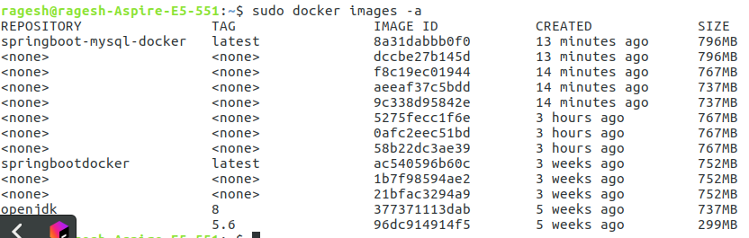
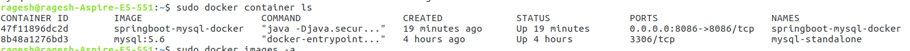

# springboot-mysql-docker-demo
This project shows how to deploy springboot with mysql application in docker container

### Docker File ##

```
FROM openjdk:8
VOLUME /tmp
EXPOSE 8086
ADD target/springboot-mysql-docker.jar springboot-mysql-docker.jar
RUN sh -c 'touch /springboot-mysql-docker.jar'
ENTRYPOINT ["java","-Djava.security.egd=file:/dev/./urandom","-jar","/springboot-mysql-docker.jar"]

```

### Keypoints to Remember ###
* Step 1: Create mysql image and container from the docker
```
docker run --name mysql-standalone -e MYSQL_ROOT_PASSWORD=password -e MYSQL_DATABASE=Student -e MYSQL_USER=sa -e MYSQL_PASSWORD=password -d mysql:5.6
```

* Step 2: Create docker image of this application from the project root folder

```
docker build . -t springboot-mysql-docker
```

* Step 3: Verify the image created or not



* Step 4: Create docker container for springboot along with the mysql image

```
docker run -p 8086:8086 --name springboot-mysql-docker --link mysql-standalone:mysql -d springboot-mysql-docker
```
* Step 5: Verfiy the application and mysql container created or not



* Step 6: Verify the application and mysql logs to check the application and connection are working
```
docker logs mysql-standalone
docker logs springboot-mysql-docker
```
* Step 7: Run the application in browser.

http://localhost:8086/courses/create  (Create course through postman)
http://localhost:8086/courses/all


### Happy Coding ####
